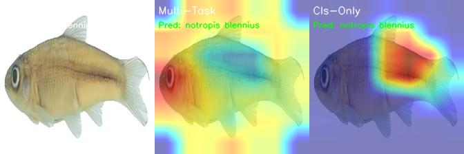

# Cerberus: Khung làm việc Học Đa tác vụ cho Phân tích Đặc điểm Cá trên Fish-Vista

Dự án này giới thiệu **Cerberus**, một kiến trúc học sâu đa tác vụ (Multi-Task Learning - MTL) được xây dựng để giải quyết đồng thời ba bài toán cốt lõi trên bộ dữ liệu **Fish-Vista**: Phân loại Loài, Nhận dạng Đặc điểm, và Phân đoạn Đặc điểm. Mục tiêu là xây dựng một mô hình không chỉ "nhận dạng" mà còn "hiểu" được cấu trúc giải phẫu của cá từ hình ảnh.

Dự án này bao gồm các thử nghiệm sâu rộng, so sánh các phiên bản khác nhau của Cerberus và các mô hình SOTA từ bài báo gốc, đồng thời khám phá các kỹ thuật tiên tiến như tích hợp ràng buộc logic và tự động cân bằng loss.

## ✨ Kết quả Nổi bật

Mô hình của chúng tôi đã đạt được những kết quả rất cạnh tranh, và trong một số trường hợp, đã thiết lập các kết quả SOTA mới trên bộ dữ liệu Fish-Vista.

| Mô hình | Species F1 (test) | Trait mAP (OOD) | Trait mAP (Manual) | Seg. mIoU (Manual) |
|:---|:---:|:---:|:---:|:---:|
| **Cerberus (MTL Gốc)** | **74.91%** | **91.44%** | 44.14% | 88.37% |
| **Cerberus+CLoss** | 68.83% | 88.13% | **47.16%** | 92.52% |
| **Hierarchical+Uncertainty** | 67.64% | 94.43% | 44.30% | **92.13%** |

*   **SOTA về Tổng quát hóa OOD:** Mô hình Hierarchical đạt **95.03% mAP** trên các loài chưa từng thấy.
*   **SOTA về Phân đoạn:** Các mô hình cải tiến đạt **trên 92% mIoU**, vượt trội so với các baseline trong paper.

*Hình ảnh ví dụ về Grad-CAM, so sánh sự tập trung của mô hình MTL và mô hình chỉ phân loại.*

## 📂 Cấu trúc Thư mục

└── fish-vista/
    ├── README.md                 # File hướng dẫn này
    ├── requirements.txt          # Các thư viện cần thiết
    ├── create_master_csv.py      # Script tổng hợp dữ liệu từ các file CSV
    ├── create_family_map.py      # Script tạo mapping cho các họ cá
    ├── create_*_matrix.py        # Scripts tạo ma trận ràng buộc logic
    ├── train_*.py                # Các script huấn luyện chính cho từng thử nghiệm
    ├── evaluate.py               # Script để đánh giá một model đã huấn luyện
    ├── visualize_*.py            # Scripts để tạo các hình ảnh trực quan hóa
    ├── code/                     # Mã nguồn tái tạo kết quả baseline của paper
    ├── Images/                   # (Bị bỏ qua bởi .gitignore) Thư mục chứa toàn bộ ảnh
    ├── checkpoints_*/            # (Bị bỏ qua bởi .gitignore) Thư mục lưu các model đã huấn luyện
    └── ...

## ⚙️ Cài đặt

Để chạy dự án này, bạn cần có Python 3.10+ và các thư viện được liệt kê trong `requirements.txt`.

**1. Clone Repository:**

git clone https://github.com/phucngvinuni/ATSIV.git
cd ATSIV

**2. Tạo Môi trường Ảo (Khuyến nghị):**

python -m venv venv
source venv/bin/activate  # Trên Windows: venv\Scripts\activate

**3. Cài đặt Thư viện:**

pip install -r requirements.txt
pip install torch torchvision torchaudio --index-url https://download.pytorch.org/whl/cu118

*(Lưu ý: Lệnh cài đặt PyTorch có thể thay đổi tùy thuộc vào phiên bản CUDA của bạn. Vui lòng tham khảo trang chủ [PyTorch](https://pytorch.org/get-started/locally/) để có lệnh cài đặt chính xác.)*

## 🚀 Hướng dẫn Sử dụng

Quy trình đầy đủ để chạy dự án từ đầu đến cuối.

### Bước 1: Chuẩn bị Dữ liệu

1.  **Tải Bộ dữ liệu Fish-Vista:**
    *   Thực hiện theo hướng dẫn trên [trang Hugging Face của Fish-Vista](https://huggingface.co/datasets/imageomics/fish-vista) để tải toàn bộ bộ dữ liệu.
    *   Sau khi tải, đảm bảo bạn có một thư mục `Images/` chứa tất cả các file ảnh và các file `.csv` gốc ở thư mục chính.

2.  **Chạy các Script Tiền xử lý:**
    Chạy các script sau theo đúng thứ tự để tạo các file metadata cần thiết.
    
    # 1. Tạo file dữ liệu tổng hợp
    python create_master_csv.py
    
    # 2. Tạo mapping cho các họ cá
    python create_family_map.py
    
    # 3. Tạo các ma trận ràng buộc logic
    python create_constraint_matrix.py
    python create_family_constraint_matrix.py
    

### Bước 2: Huấn luyện Mô hình

Dự án này bao gồm nhiều thử nghiệm khác nhau. Dưới đây là cách chạy các script huấn luyện chính.

**a) Huấn luyện mô hình Cerberus+Uncertainty (kết quả tốt nhất về segmentation):**

python train_uncertainty_weighting.py --run-name "my_uncertainty_run" --epochs 50 --batch-size 16

*   `--run-name`: Đặt tên cho thư mục lưu checkpoint.
*   Checkpoints sẽ được lưu trong `checkpoints_uncertainty/my_uncertainty_run/`.

**b) Huấn luyện mô hình Hierarchical (kết quả tốt nhất về OOD):**
*Lưu ý: Cần có script `train_hierarchical.py` để chạy thử nghiệm này.*

python train_hierarchical.py --run-name "my_hierarchical_run" --epochs 50 --batch-size 16

### Bước 3: Đánh giá Mô hình

Sau khi huấn luyện, bạn có thể sử dụng script `evaluate.py` để đánh giá model tốt nhất trên tất cả các tập test.

python evaluate.py \
    --checkpoint-path "checkpoints_uncertainty/my_uncertainty_run/best_model.pth" \
    --output-file "evaluation_results_my_run.json"

*   `--checkpoint-path`: Đường dẫn đến file `.pth` của model bạn muốn đánh giá.
*   `--output-file`: Tên file JSON để lưu kết quả.

### Bước 4: Trực quan hóa

Sử dụng các script `visualize_*.py` để hiểu sâu hơn về mô hình.

**a) Trực quan hóa Grad-CAM (So sánh sự tập trung):**
*Yêu cầu phải có checkpoint của cả model MTL và model baseline.*

python visualize_gradcam.py

*Kết quả sẽ được lưu trong thư mục `gradcam_visualizations/`.*

**b) Trực quan hóa Đầu ra Đa tác vụ:**

python visualize_multitask.py

*Kết quả sẽ được lưu trong thư mục `multitask_visualizations/`.*

## 📚 Tổng quan các Thử nghiệm

Dự án đã khám phá các phiên bản khác nhau của kiến trúc Cerberus:
*   **Cerberus (MTL Gốc):** Nền tảng MTL với 3 tác vụ. Tốt nhất cho phân loại loài và tổng quát hóa OOD.
*   **Cerberus+CLoss:** Bổ sung Ràng buộc Logic giữa loài và đặc điểm. Cải thiện nhận dạng trên nhãn mạnh.
*   **Cerberus+Uncertainty:** Tự động cân bằng các loss. Tốt nhất cho phân đoạn.
*   **Hierarchical:** Bổ sung tác vụ dự đoán Họ. Cải thiện đáng kể khả năng tổng quát hóa OOD.

## 📈 Hướng phát triển Tương lai

1.  **Fine-tuning trên Nhãn mạnh:** Sử dụng một tập dữ liệu nhỏ nhưng có nhãn chính xác 100% để "dạy lại" cho mô hình về các đặc điểm hiếm.
2.  **Cân bằng Tác vụ Nâng cao:** Khám phá các kỹ thuật như Gradient Surgery để giải quyết triệt để sự can thiệp tiêu cực giữa các tác vụ.
3.  **Hoàn thiện Dữ liệu:** Đóng góp bằng cách gán nhãn bổ sung cho các loài và các tác vụ còn thiếu trong bộ dữ liệu gốc.

